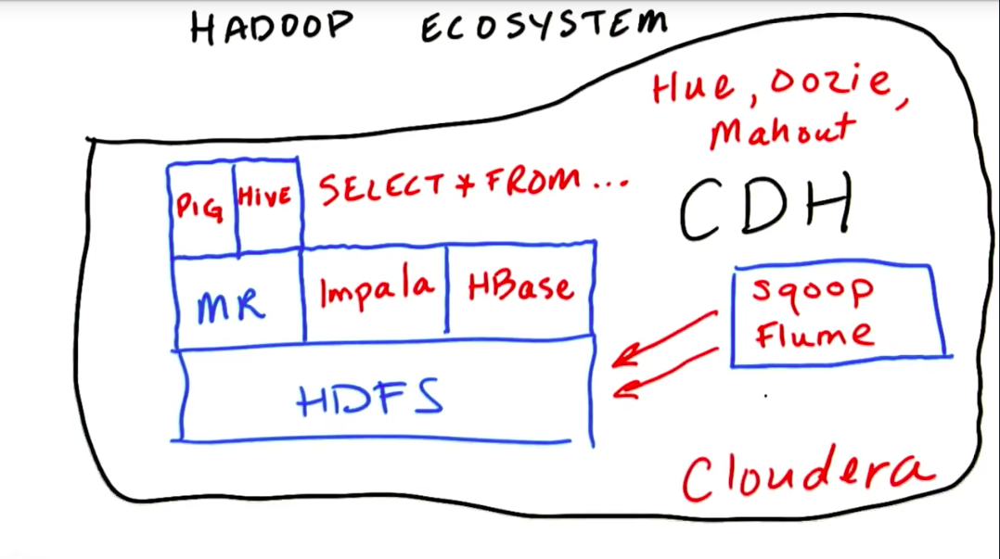

# learn-ParallelProgram

## GPU

与parallel programming相对的是serial programming，前者是并行程序，后者是串行程序。
 
在服务器前端的serial programming中，可以采取异步的编程方式，也就是程序各部分的结果可以相互独立展示，其中一部分的结果出错不影响整个页面的展示。
 
编程中最重要的两部分是data和code，或者说是data store和data process，涉及到的最重要的两个系统是数据库系统和计算系统。

数据库系统本质上是两个部分，一部分是硬盘文件，另一部分是硬盘与内存数据交互的程序。对于单机（单个控制系统、单个硬盘）的数据库系统，最常用的是mysql，最常用的语言是SQL。为了解决要存储的数据极大的问题，目前多采取把多台计算机、多个硬盘并行的方式，也就是分布式的方式，目前最常见的分布式数据库系统是hadoop。分布式数据库系统所存在的物理介质是a collect of machines known as a cluster （more machines can be added to the cluster when data grow）. 对于hadoop，所使用的硬盘系统是HDFS，硬盘与内存数据交互的方法是MapReduce。

Map就是在储存数据的单机上完成单机的处理，也就是one to one的并行方式，Reduce就是把所有单机的处理结果汇总到一台单机上来，也就是all to one的并行方式。硬盘与内存数据交互的MapReduce可以用C语言来写，但写起来很费事。有现成的工具可以帮助用简单的编程完成MapReduce，比如Hive和Pig。在Hive中，可以使用SQL语言来完成硬盘与内存数据交互（底层还是在做MapReduce. Hive interpreter turns the SQL into MapReduce code which then runs on the cluster）。Pig用的不是SQL，但也是一种很简单的脚本语言，比直接用C语言来写MapReduce要简单的多。Hive和Pig本质上用的仍然是MapReduce的方法，但多了一步把其他语言转换为C语言的过程，很多时候速度是很慢的。Impala用的也是SQL语言，但思路上并不是转换为C语言的MapReduce code，而是直接作用于HDFS文件（optimized for low latency queries, 比较注重查询的速度而不是通量）。Hive注重的是通量（optimized for long batch processing jobs）。还有一些工具是帮助加速或方便把数据load into the HDFS file system。

sqoop就是帮助把数据从SQL数据库中导入到HDFS file中。flume做的事把其他应用产生的数据导入到HDFS file中。HBase is a real time database，和impala是类似的。Hue is a graphical front end to the questor. Oozie is a workflow management tool. Mahout is a machine learning library. 

对于计算系统，有三种办法来增加计算力，一是增加单个processor的计算力，二是增加单个chip上processor的数量，三是把多个chip并行起来。单个processor的计算力目前已经进入瓶颈期，增加单个chip上processor的数量是目前的主流，速度还是要比把多个chip并行起来快很多。多核电脑本质上就是在一个cpu chip上配有多个processor. 当然，为了在最大程度上增加计算力，可以把二和三结合起来，既在chip上放置很多的processor，又把多个chip并行起来。

在分布式系统中，可以这样处理：首先是cluster集群的Map。在每台单机上，把HDFS数据库中的数据读入到cpu内存中，然后转入到gpu内存中，经由gpu计算后，再转入到cpu内存中，存入到单机HDFS数据库中。然后是数据交互的MapReduce。把单机HDFS数据库中的数据先处理再归一到一台机器上，呈现最后的结果。

CPU和GPU都是把多个processor放置在chip上，完成计算，但二者的设计目标是不同的。CPU的控制系统更加复杂，目标是高速度、低延迟，相当于跑车。GPU的控制系统更加简单，适合计算简单的重复任务，目标是高通量，相当于大客车。对于机器学习分析数据，追求的是高通量，使用GPU相当合适。由于控制系统简单，GPU的chip上可以放置比CPU多得多的processor（CPU如果放置这么多的processor的话，控制系统根本没法合理安排）。

GPU最初的设计是用来计算处理图像的，图像处理具有这样高通量的特性。当然，除了图像处理，还有机器学习等多种应用需要高通量的特性。GPU之外，还可以设计其他高通量的处理器，比如专门为机器学习优化过的高通量处理器（GPU是专门为图像处理优化的高通量处理器）。

CUDA是GPU的操作系统，就好像hadoop是分布式系统的操作系统一样。可以按CUDA的方式用C语言编写程序，用CUDA compiler编译后，控制GPU的计算。在CUDA编程中，首先设好kernal，是单个thread所要完成的任务，是GPU所要完成的任务。然后设置CPU的host memory，然后把CPU的数据转入GPU中（一般转入global memory，由CPU控制）。之后，由CPU启动kernal。kernal完成计算后，再由CPU把GPU中的数据转到CPU的host memory中。

Parallel programming有多种communication patterns, 前面提到的map和reduce是其中两种，map is one to one, reduce is all to one. Besides, gather is many to one, scatter is one to many. Stencil can be finished by gather or scatter. Transpose is like matrix transpose for an array. 

GPU计算的基本物理单位是SM（processor）, block, thread。kernal是功能单位。GPU memory分为local，shared，global。速度上local > shared >> global。为了使不同的thread相互配合，需要synchronization和barriers。还可以使用atomic operation来使得不同的thread逐次执行。

Effieicent GPU programming:

1. Access memory faster
    * move data to local or shared memory
    * coalescing global memory, that is, make adjacent threads access continuous memory
2. Avoid thread divergence such as branches and loops
    * if different thread execute different loops, we shouldn't let some threads wait for others

## CPU

线程比进程功能更强大，适合进行内存等层面的数据交流，进程比线程更安全，对于没有数据交流的线程，把他们放到不同的进程中能保证互不干扰。Queue.Queue的话，适合用于不同线程的数据交流，进行过优化，避免了使用lock机制，数据产生者、Queue.Queue、数据消费者用的都是同一块内存。redis的话，数据产生者可以把数据存入redis，不同的数据产生者相互之间没有干扰（假设存入redis不需要有规定的先后），可以用多进程实现。数据消费者从redis中消费数据，和数据产生者也没有直接的数据交流，可以用单独的进程实现？实际上涉及到三块内存：数据产生者用的内存（分成了很多小块），redis用的内存（从数据产生者用的内存copy而来，要copy到数据消费者用的内存中去），数据消费者用的内存。可以看出来，用Queue.Queue实现，更省内存，效率更高，用redis实现，更费内存，效率更低（多了copy操作），但更加安全。

